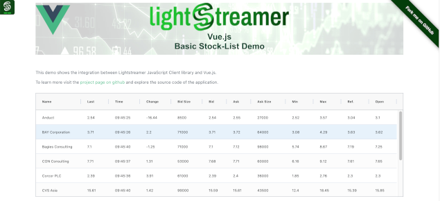

# Lightstreamer - Basic Stock-List Demo - Vue.js Client
<!-- START DESCRIPTION lightstreamer-example-stocklist-client-javascript-basic-stock-list-demo---vue-client -->

This project contains a demo application showing the integration between the Lightstreamer Web Client library and Vue.js.

## Live Demo

<br>
### [ View live demo](http://demos.lightstreamer.com/VueDemo/)

## Details

This demo displays real-time market data for ten stocks generated by a feed simulator and is based on [Basic Stock-List Demo](https://github.com/Lightstreamer/Lightstreamer-example-StockList-client-javascript#basic-stock-list-demo---html-client). <br>

This project uses the <b>Web Client SDK API for Lightstreamer</b> to handle the communications with Lightstreamer Server and uses <b>Vue.js</b> library to display the real-time data pushed by Lightstreamer Server.

The onItemUpdate callback, of a Lightstreamer Subscription, updates an object binded to a Vue.js component, which keeps in sync the real-time data with the DOM.

If you want to go deeper into Vue, check out the [Vue.js site](https://vuejs.org).

<!-- END DESCRIPTION lightstreamer-example-stocklist-client-javascript-basic-stock-list-demo---vue-client -->

## Install

If you want to install a version of one of these demos pointing to your local Lightstreamer Server, follow these steps:

* Note that, as prerequisite, the [Lightstreamer - Stock- List Demo - Java Adapter](https://github.com/Lightstreamer/Lightstreamer-example-Stocklist-adapter-java) has to be deployed on your local Lightstreamer Server instance. Please check out that project and follow the installation instructions provided with it.
* Launch Lightstreamer Server.
* Get the `lightstreamer.js` file from [npm](https://www.npmjs.com/package/lightstreamer-client-web) or [unpkg](https://unpkg.com/lightstreamer-client-web/lightstreamer.js) and put it in the `src/js` folder of the demo (if that is the case, please create it).
  Alternatively, you can generate a customized lightstreamer.js library containing only the classes you actually use;
  see the build instructions on the [GitHub page](https://github.com/Lightstreamer/Lightstreamer-lib-client-javascript#building).
  In that case, be sure to include the LightstreamerClient, Subscription, ConnectionSharing, and StatusWidget modules.

You can deploy these demos to use the Lightstreamer server as Web server or in any external Web Server you are running. 
If you choose the former case, please create the folders `<LS_HOME>/pages/demos/[demo_name]` then copy here the contents of the `src/[demo_name]` folder of this project.<br>
The client demos configuration assumes that Lightstreamer Server, Lightstreamer Adapters, and this client are launched on the same machine. If you need to target a different Lightstreamer server, please search this line:
```js
lsClient = new Lightstreamer.LightstreamerClient(protocolToUse+"//localhost:"+portToUse,"DEMO");
```
in `js/index.js`, and change it accordingly.<br>

The demo is now ready to be launched.

## See Also

### Lightstreamer Adapters Needed by These Demo Clients
<!-- START RELATED_ENTRIES -->

* [Lightstreamer - Stock-List Demo - Java Adapter](https://github.com/Lightstreamer/Lightstreamer-example-Stocklist-adapter-java)
* [Lightstreamer - Reusable Metadata Adapters - Java Adapter](https://github.com/Lightstreamer/Lightstreamer-example-ReusableMetadata-adapter-java)

<!-- END RELATED_ENTRIES -->

### Related Projects

* [Lightstreamer - Stock-List Demos - HTML Clients](https://github.com/Lightstreamer/Lightstreamer-example-StockList-client-javascript#basic-stock-list-demo---html-client)

## Lightstreamer Compatibility Notes

* Compatible with Lightstreamer Web Client library version 8.0 or newer.

* For a version of this example compatible with Lightstreamer SDK for Web Clients version 7.x or earlier, please refer to [this tag](https://github.com/Lightstreamer/Lightstreamer-example-StockList-client-vue/releases/tag/latest-for-client-7.x).
